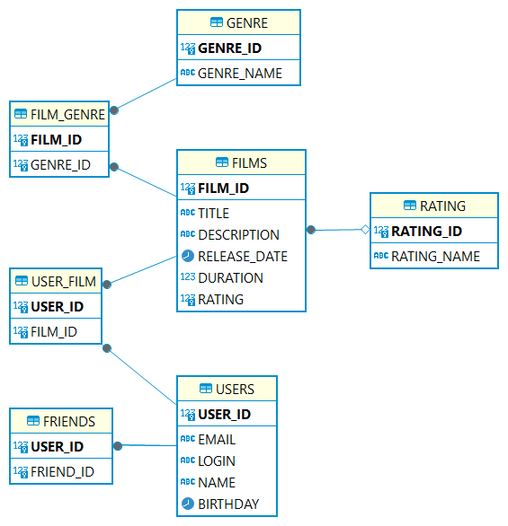

# java-filmorate
Представьте, что после изучения сложной темы и успешного выполнения всех заданий вы решили отдохнуть и провести вечер за просмотром фильма. Вкусная еда уже готовится, любимый плед уютно свернулся на кресле — а вы всё ещё не выбрали, что же посмотреть!


Фильмов много — и с каждым годом становится всё больше. Чем их больше, тем больше разных оценок. Чем больше оценок, тем сложнее сделать выбор. Однако не время сдаваться! Вы напишете бэкенд для сервиса, который будет работать с фильмами и оценками пользователей, а также возвращать топ-5 фильмов, рекомендованных к просмотру. Теперь ни вам, ни вашим друзьям не придётся долго размышлять, что посмотреть вечером.


# Template repository for Filmorate project.


Список таблиц
FILMS - список фильмов
GENRE - список жанров фильмов
FILM_GENRE - таблица для связи фильмов с жанрами (у одного фильма может быть несколько жанров)
RATING - список возрастных ограничений (рейтинг MPA)
USERS - список пользователей
USER_FILM - список пользователей, поставивших лайк фильму
FRIENDS - список друзей пользователя

Примеры запросов:

1. Получить 10 самых популярных фильмов:

```
SELECT F.*, R.*, COUNT(UF.FILM_ID) AS LIKES
FROM FILMS AS F
LEFT JOIN RATING AS R ON R.RATING_ID = F.RATING
LEFT JOIN USER_FILM AS UF ON F.FILM_ID = UF.FILM_ID
GROUP BY F.FILM_ID
HAVING LIKES > 0
ORDER BY LIKES DESC
LIMIT 10;

```

2. Список друзей пользователя

```
SELECT * FROM USERS 
WHERE USER_ID IN (SELECT FRIEND_ID FROM FRIENDS WHERE USER_ID=?);

```

3. Список общих друзей

```
SELECT U.*
FROM USERS AS U
JOIN FRIENDS F1 ON U.USER_ID = F1.FRIEND_ID AND F1.USER_ID=?
JOIN FRIENDS F2 ON U.USER_ID = F2.FRIEND_ID AND F2.USER_ID=?

```
